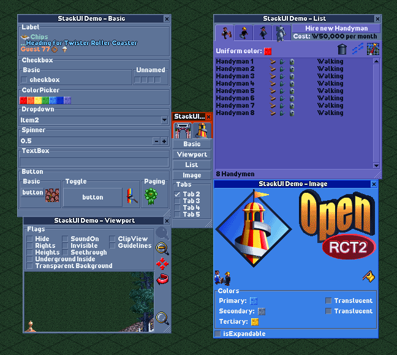
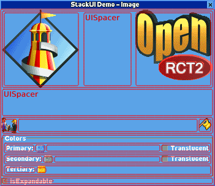
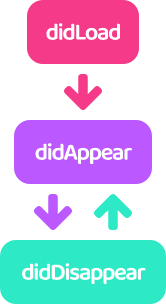

<p align="center">

<br /><br />


<br /><br />
✨ OpenRCT2 플러그인 개발자를 위한 사용하기 쉬운 UI 프레임워크.
<a href="README.md"><strong>[English]</strong></a>
</p>
<br /><br /><br />

## ✨ 시작하기

1. 이 저장소를 Fork 하세요. (플러그인 제작을 위한 기반 템플릿으로서 사용할 수 있습니다.)
2. 개발을 위해 마련한 공간에 Fork 한 저장소를 내려받으세요.
3. `.../modules` 디렉토리에 [openrct.2.d.ts](https://github.com/OpenRCT2/OpenRCT2/tree/develop/distribution/openrct2.d.ts) 파일을 다운받아 넣으세요.
4. `.../develop` 디렉토리에서 플러그인 개발을 시작하세요.

<br />

## 🌍 데모



데모 플러그인에 대부분의 사용 예시가 포함되어 있습니다.

`.../develop` 디렉토리의 `plugin.ts` 파일을 참고하세요.

<br />

## ⚙ 개발

궁금한 내용을 펼쳐서 확인하세요.

<details>
<summary><strong>🎢 개발 단계</strong></summary>

StackUI를 이용한 플러그인 개발은 아래의 단계로 이루어집니다.

1. 윈도우 구조 설계

```tsx
//빈 라벨이 포함된 하나의 탭이 있는 윈도우를 구성합니다.
UIWindow.$(
    UITab.$(
        UILabel.$("")
    )
);
```

2. 초기 데이터 준비 및 설정

```tsx
//초기 윈도우에서 보여줄 정보를 정의하고 설정합니다.
const text = "Label";

UIWindow.$(
    UITab.$(
        UILabel.$(text)
    ).image(UIImageTabGears)
).title("Window");
```

3. 프록시 정의

```tsx
//UI로 명령 전달 및 액션 응답을 위한 프록시를 정의합니다.
const windowProxy = UIWDP.$();
const labelProxy = UIWP.$<UILabel>();

const text = "Label";

UIWindow.$(
    UITab.$(
        UILabel.$(text)
    ).image(UIImageTabGears)
).title("Window");
```

4. 프록시 바인딩

```tsx
const windowProxy = UIWDP.$();
const labelProxy = UIWP.$<UILabel>();

const text = "Label";

//프록시를 UI와 바인딩합니다.
UIWindow.$(
    UITab.$(
        UILabel.$(text).bind(labelProxy)
    ).image(UIImageTabGears)
).bind(windowProxy)
.title("Window");
```

5. UI 액션 바인딩

```tsx
const windowProxy = UIWDP.$();
const labelProxy = UIWP.$<UILabel>();

const text = "Label";

UIWindow.$(
    UITab.$(
        UILabel.$(text).bind(labelProxy)
    ).image(UIImageTabGears)
).bind(windowProxy)
.title("Window");

//UI 액션에 따라 실행할 코드를 작성합니다.
windowProxy.didAppear((window) => {
    console.log(window.getTitle());
    console.log(`before: ${labelProxy.ui?.getText()}`);
    labelProxy.updateUI((label) => {
        label.text(`${window.getTitle()} is opened.`);
    });
    console.log(`after: ${labelProxy.ui?.getText()}`);
});
```

6. 창 열기

```tsx
const windowProxy = UIWDP.$();
const labelProxy = UIWP.$<UILabel>();

const text = "Label";

UIWindow.$(
    UITab.$(
        UILabel.$(text).bind(labelProxy)
    ).image(UIImageTabGears)
).bind(windowProxy)
.title("Window");

windowProxy.didAppear((window) => {
    console.log(window.getTitle());
    console.log(`before: ${labelProxy.ui?.getText()}`);
    labelProxy.updateUI((label) => {
        label.text(`${window.getTitle()} is opened.`);
    });
    console.log(`after: ${labelProxy.ui?.getText()}`);
});

//위의 내용을 기반으로 한 창을 엽니다.
windowProxy.show();
```
---
</details>

<details><summary><b>📄 참고 문서</b></summary>

---

<details><summary><b>💠 UIWindow</b></summary>

- $: 위젯 목록으로 초기화
- $T: 탭 목록으로 초기화

속성
- spacing
- padding
- origin
- minSize
- maxSize
- isExpandable
- title
- selectedTabIndex
- selectedTabName
- theme

액션
- show
- updateUI
- close
- bringToFront
- findWidget
- bind
- getUITab
- getUIWidget

핸들러
- onClose
- onTabChange
- didLoad
- didAppear
- didDisappear

</details>
<details><summary><b>📑 UITab</b></summary>

- $: 위젯 목록으로 초기화

속성
- name
- spacing
- padding
- isExpandable
- minSize
- maxSize
- image
- title
- theme
- isHidden

액션
- updateUI
- bind
- getUIWidget

핸들러
- didLoad
- didAppear
- didDisappear

</details>
<details><summary><b>🧒 UIWidget</b></summary>

속성
- origin
- offset
- extends
- size
- minSize
- occupiedSize
- name
- tooltip
- isDisabled
- isVisible
- font
- description

액션
- updateUI
- bind
- resetSize

핸들러
- didLoad
- didAppear
- didDisapp

파생 위젯

<details><summary><b>🛹 UIStack</b></summary>

- $: 위젯 목록으로 초기화
- $V: 위젯 목록을 수직으로 배치하여 초기화
- $H: 위젯 목록을 수평으로 배치하여 초기화
- $VG: 위젯 목록을 수직으로 배치하여 초기화 하며, 그룹박스 표시
- $HG: 위젯 목록을 수평으로 배치하여 초기화 하며, 그룹박스 표시

속성
- axis
- spacing
- padding
- isGrouped
- title
- childs

</details>
<details><summary><b>🏷️ UILabel</b></summary>

- $: 문자열로 초기화

속성
- align
- text

핸들러
- onChange

</details>
<details><summary><b>🌌 UISpacer</b></summary>

- $: 공백 값으로 초기화

속성
- axis
- spacing

</details>
<details><summary><b>🔘 UIButton</b></summary>

- $: 텍스트로 초기화
- $I: 이미지로 초기화

속성
- border
- image
- isPressed
- title

액션
- isImageEqual

핸들러
- onClick

파생 위젯
<details><summary><b>🔲 UIToggleButton</b></summary>

액션
- toggle

핸들러
- onPress

</details>
<details><summary><b>🔄 UIPageImageButton</b></summary>

- $IP: 이미지 목록으로 초기화

액션
- images
- currentIndex

핸들러
- onPage

</details>

---

</details>
<details><summary><b>🔁 UISpinner</b></summary>

- $: 기본 값으로 초기화

속성
- range
- step
- fixed
- value
- formatter

액션
- dialogueInfo

핸들러
- onChange

</details>
<details><summary><b>✅ UICheckbox</b></summary>

- $: 타이틀로 초기화
- $UN: 타이틀 없이 초기화

속성
- isChecked
- text

액션
- toggle

핸들러
- onChange

</details>
<details><summary><b>🔽 UIDropdown</b></summary>

- $: 문자열 목록으로 초기화

속성
- items
- selectedIndex

핸들러
- onChange

</details>
<details><summary><b>🔳 UIColorpicker</b></summary>

- $: 색상으로 초기화

속성
- color

핸들러
- onChange

</details>
<details><summary><b>🖼️ UIImageView</b></summary>

- $: 이미지로 초기화

속성
- image
- theme

</details>
<details><summary><b>🎑 UIViewport</b></summary>

- $: 기본값으로 초기화

속성
- position
- rotation
- zoom
- flags
- centerPosition

액션
- moveTo
- scrollTo
- scrollToMainViewportCenter
- moveToMainViewportCenter
- mainViewportScrollToThis

</details>
<details><summary><b>📃 UIListView</b></summary>

- $: 리스트뷰 열로 초기화

속성
- scrollbarType
- isStriped
- showColumnHeaders
- selectedCell
- canSelect
- columnData
- itemData
- highlightedCell
- columns
- items

액션
- addColumn(s)
- addItem(s)
- clearAllItems

핸들러
- onHighlight
- onClick

하위 요소
<details><summary><b>🏷️ UIListViewColumn</b></summary>

- $: 기본 열 너비로 초기화
- $F: 고정된 열 너비로 초기화
- $R: 범위 열 너비로 초기화
- $W: 비율 열 너비로 초기화

속성
- sortOrder
- canSort
- tooltip

</details>
<details><summary><b>⚪ UIListViewItem</b></summary>

- $: 문자열 목록으로 초기화
- $S: 분리 행으로서 문자열로 초기화

속성
- isSeparator
- elements

</details>

---

</details>
<details><summary><b>📄 UITextbox</b></summary>

- $: 문자열로 초기화

속성
- text
- maxLength

핸들러
- onChange

</details>

---

</details>

<details><summary><b>🛰️ UIProxy</b></summary>

- $: 기본 초기화

속성
- ui

액션
- updateUI

핸들러
- didLoad
- didAppear
- didDisappear

파생 프록시
<details><summary><b>💠 UIWindowProxy (UIWDP)</b></summary>

액션
- show
- close

핸들러
- onTabChange
- onClose

</details>

<details><summary><b>📑 UITabProxy (UITP)</b></summary>
</details>

<details><summary><b>🧒 UIWidgetProxy (UIWP)</b></summary>

핸들러
- onClick
- onChange

</details>

---

</details>

<details><summary><b>🖼️ UIImage</b></summary>

- $: 단일 이미지로 초기화
- $A: 연속 애니메이션 이미지로 초기화
- $F: 비연속 애니메이션 이미지로 초기화

속성
- isAnimatable
- duration
- offset
- singleFrame
- size
- description
- string

액션
- isEqual

</details>

<details><summary><b>🏗️ TextBuilder (TB)</b></summary>

- $: 텍스트 노드로 초기화

속성
- font
- outline
- color
- description

액션
- build

하위 요소
<details><summary><b>⭐ TextNode (TN)</b></summary>

- $: 텍스트 노드 목록으로 초기화
- $S: 문자열로 초기화
- $I: 이미지로 초기화
- $NL: 개행 노드로 초기화

속성
- outline
- color

</details>

---

</details>

<details><summary><b>⛑️ Helper</b></summary>
<details><summary><b>⏲️ IntervalHelper</b></summary>

전역: intervalHelper

액션
- start
- enabled
- end

</details>
<details><summary><b>🖼️ ImageHelper</b></summary>

전역: imageHelper

액션
- graphicsContext

</details>
</details>

---

</details>

<details><summary><b>🧩 UI 계층</b></summary>



포함관계는 다음과 같습니다.

```
UIWindow
    └ UITab (optional)
        └ UIStack (optional)
            └ UIWidget (UILabel, UIButton, ...)
            └ UIListView
                └ UIListViewColumn
                └ UIListViewItem
```

</details>

<details><summary><b>🔎 UI 탐색</b></summary>

일반적으로 프록시를 통해 위젯을 제어하지만,
그 외의 방법으로도 탭과 위젯을 탐색할 수 있습니다.

---

UI 항목의 이름을 직접 설정한 후 아래의 함수로 탐색합니다.

1. UIWindow
    - getUITab
    - getUIWidget
2. UITab
    - getUIWidget

</details>
<details><summary><b>🔃 UI 업데이트</b></summary>

일반적으로 updateUI 블럭 내에서 속성을 수정하여 UI를 갱신할 수 있습니다.

```tsx
const proxy = UIWP.$<UIButton>();

//...

proxy.onClick((w) => {
    w.updateUI(() => {
        w.isPressed(w.getIsPressed());
    });
});
```

---

블럭 밖에서도 UI 갱신은 가능하나, 권장하지 않습니다.
예상하지 못한 부작용이 발생할 수 있기 때문입니다.

```tsx
const proxy = UIWP.$<UIButton>();

//...

proxy.onClick((w) => {
    w.isPressed(w.getIsPressed());
    w.updateUI();
});
```

---

    💡 창과 탭의 경우, 일부 설정이 변경되면 
    변경사항 적용을 위해 내부적으로 창이 다시 열릴 수 있습니다. 
    이는 생명주기와는 별개로 진행됩니다.

</details>
<details><summary><b>♻️ UI 생명주기</b></summary>



StackUI에서 UI는 생명주기를 가지며, 상태에 따라 Hook을 제공합니다.

---

1. didLoad
    - UI를 처음 불러올 때 단 한 번만 호출됩니다.
2. didAppear
    - UI가 화면에 나타날 때 마다 호출됩니다.
    - UITab의 경우, 활성화 될 때 호출됩니다.
    - UIWidget.isVisible과는 관련이 없습니다.
3. didDisappear
    - UI가 화면에서 가려질 때 마다 호출됩니다.
    - UITab의 경우, 비활성화 될 때 호출됩니다.
    - UIWidget.isVisible과는 관련이 없습니다.

</details>
<details><summary><b>🖼️ 이미지 사용</b></summary>

이미지는 스프라이트 번호로 초기화합니다.
(관련 정보는 `UIImageConstants`의 주석을 확인하세요.)

---

UIImage는 3가지 유형으로 나눌 수 있습니다.

1. 단일 이미지
    - 이미지를 사용하는 모든 곳에서 사용할 수 있습니다.
2. 연속 애니메이션 이미지
    - 탭과 버튼에만 사용할 수 있습니다.
3. 비연속 애니메이션 이미지
    - 커스텀 유형으로, 현재는 버튼에서만 사용할 수 있습니다.

---

일반적으로 사용하는 이미지는 미리 정의하여 `UIImageConstants`에 포함하였습니다.

    💡 플러그인에 포함되는 코드의 양이 부담될 수 있으므로,
    사용하지 않는 이미지들은 주석 처리해주세요.

</details>
<details><summary><b>🥂 화려한 텍스트</b></summary>

TextBuilder를 이용하면 TextNode의 조합으로 스타일을 가진 문자열을 생성할 수 있습니다.

TextNode는 3가지 유형이 있습니다.

1. StringNode
    - 문자열 노드입니다.
    - `\n`로 줄바꿈을 할 수 있습니다.
2. ImageNode
    - 이미지를 문자열 노드 사이에 삽입합니다.
3. NewlineNode
    - 줄바꿈 노드입니다.
    - 다음 노드를 다음 줄부터 표시합니다.

TextBuilder는 문자열의 글꼴을, TextNode는 문자열의 색상과 외곽선을 정의합니다.

---

아래는 데모에 포함된 예제입니다.


```tsx
const formatted = TB.$(
        TN.$(
            TN.$I(UIImageShopItemChips),
            TN.$(
                TN.$S("Chips\n..."),
                TN.$(
                    TN.$S((1432).format(TextFormat.StringId, 53))
                        .color(TextColor.BabyBlue),
                    TN.$NL()
                ).outline()
            ).color(TextColor.Celadon),
            TN.$S((767).format(TextFormat.StringId, 77)),
            TN.$I(UIImageShopItemDoughnut),
            TN.$I(UIImageShopItemIceCream)
        ).color(TextColor.Topaz)
    ).build();
```

</details>
<details><summary><b>📑 알아두기</b></summary>

**UI의 위치 및 크기**

- 윈도우의 크기는 위젯의 크기를 기준으로 하여 최소크기 및 최대크기 내에서 자동으로 조절됩니다.
- 크기가 지정되지 않은 위젯은 윈도우 크기에 따라 자동으로 조절됩니다.
- 크기가 지정되지 않은 위젯들은 스택 내에서 일정 간격의 거리를 두고 배치됩니다.
- 일부 위젯은 특성에 따라 높이 또는 너비가 고정되어 있습니다.

</details>
<br />

## 🚀 빌드하기

만든 플러그인을 적용해 봅시다.

(타입스크립트를 기준으로 설명합니다.)

**우선, 의존 모듈을 설치합니다.**

> `npm install`

### 🏗️ 빌드

> `npm run build`

`.../develop` 디렉토리에 `plugin.js` 파일을 출력합니다.

    ⚠ 당신이 개발한 플러그인에 StackUI 관련 코드가 모두 포함됩니다.
    이는 기반이 되는 `openrct2.d.ts` 파일이 짧은 주기로 업데이트 되어,
    호환성 이슈가 발생할 수 있기 때문입니다.

### 🔄 자동 빌드

> `npm run watch`

`npm run build` 커맨드에 의해 `plugin.js` 파일이 출력될 때 마다, 플러그인 폴더로 복제합니다.

<details><summary><b>❗Tip. 핫 리로드 활성 (Windows 기준)</b></summary>

`.../Users/User/Documents/OpenRCT2/config.ini` 파일을 열어, `enable_hot_reloading = false`를 `enable_hot_reloading = true`로 변경한 후 저장합니다.

</details>

### 📀 배포

> `npm run build-product`

`.../develop` 디렉토리에 최적화 된 플러그인 파일, `plugin.min.js`를 출력합니다.

기본 환경 설정은 [plugin-devtools](https://github.com/OpenRCT2/plugin-devtools)를 차용하였습니다.

<br />

## 📜 라이센스

이 프로젝트는 MIT 라이센스 하에 있습니다.